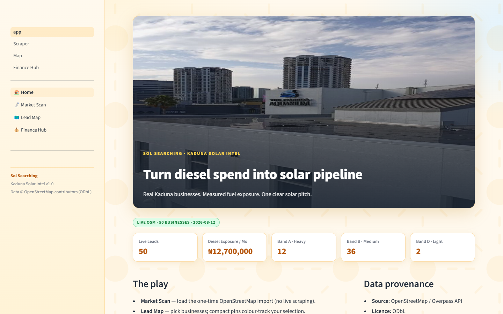
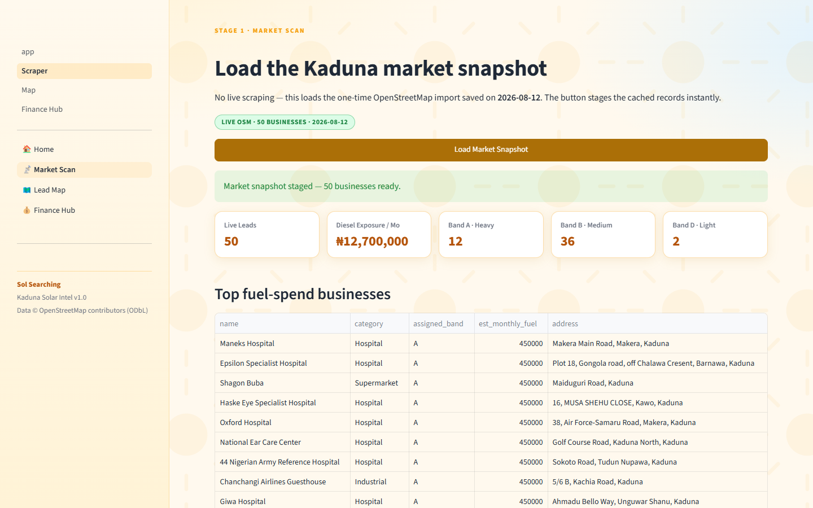
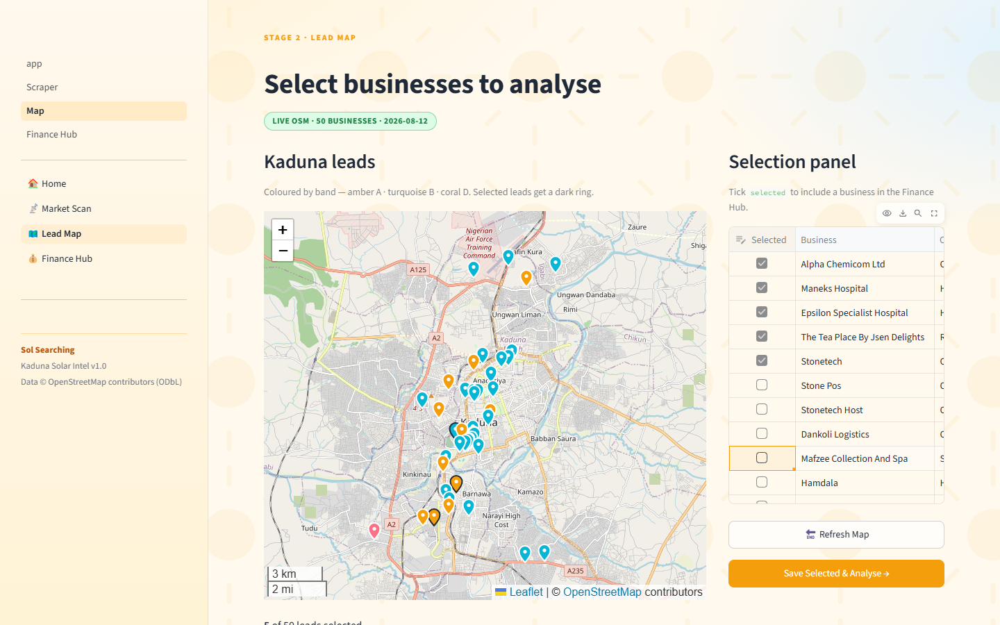
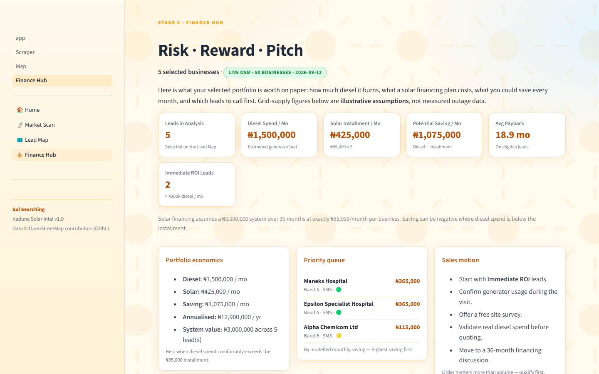
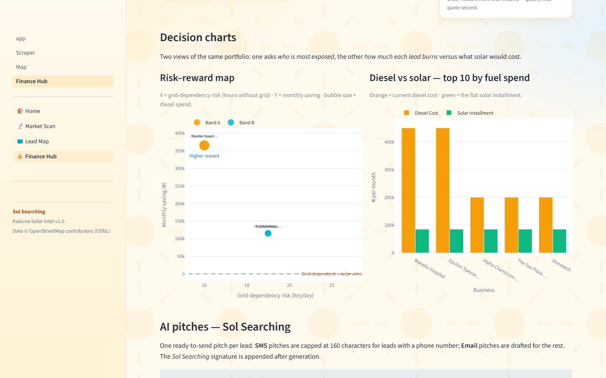
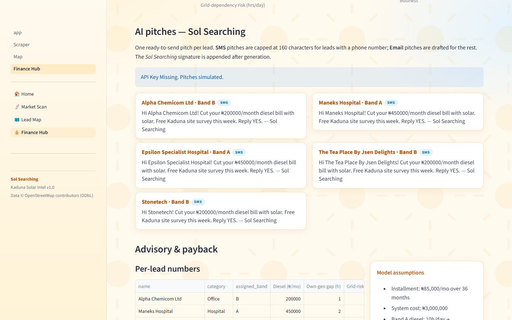

# Kaduna Solar Lead Gen — Sol Searching

Turn real Kaduna businesses into a solar sales pipeline. Select leads on a map,
and get portfolio economics, a priority queue, ready-to-send pitches, and a
CSV export for your sales rep.

**Built with Streamlit** · Data: OpenStreetMap (ODbL) · Runs fully offline at
runtime — no live scraping.

🔗 **Live demo:** https://kaduna-solar-lead-ge-y3wljh2pqvkadljhlytgkg.streamlit.app



## Why this exists

Kaduna businesses run on generators. Every naira of diesel is money a solar
financing plan could stabilise. **Sol Searching** takes a verified list of 50
real Kaduna businesses, estimates each one's monthly fuel exposure, and turns
that into a ranked, quantified, pitch-ready sales pipeline — in three clicks.

The workflow mirrors how a solar sales team actually works:

1. **Scan the market** — load the frozen, verified business list.
2. **Pick your targets** — select businesses on a map, colour-coded by
   diesel exposure band.
3. **Read the plan** — portfolio economics, a priority queue, decision
   charts, and one ready-to-send pitch per lead, plus a CSV hand-off.

## The walkthrough

### Stage 1 · Market Scan

Loads the one-time OpenStreetMap import (50 verified businesses) and stages it
for analysis. The KPI row summarises the whole market: **₦12,700,000** of
estimated monthly diesel exposure across 12 heavy (Band A), 36 medium
(Band B) and 2 light (Band D) consumers, with the top fuel spenders listed.



### Stage 2 · Lead Map

All 50 leads plotted on an interactive Kaduna map. Pins are compact
band-coloured teardrops — amber **A** (heavy), turquoise **B** (medium), coral
**D** (light) — and selected leads get a dark ring so you can see your
portfolio forming. Tick businesses in the selection panel (or untick to drop
them), then save to analyse.



### Stage 3 · Finance Hub — Risk · Reward · Pitch

The decision cockpit. A six-card snapshot quantifies the selected portfolio —
diesel spend, solar installments, potential saving, average payback, and how
many leads clear the immediate-ROI bar. Below it, a three-column brief covers
portfolio economics, the priority queue (highest modelled saving first), and
the sales motion.



### Decision charts

Two views of the same portfolio: a **risk–reward map** (grid-dependency risk
versus monthly saving, bubble size = diesel spend) and a **diesel-vs-solar
bar chart** for the top 10 fuel spenders.



### AI pitches

One ready-to-send pitch per lead: **SMS** (≤160 characters) when a phone
number exists, a **professional email** otherwise — each signed off as *Sol
Searching*. Generated with Gemini Flash when an API key is configured;
clearly labelled *"API Key Missing. Pitches simulated."* with canned fallback
text when not, so the demo never breaks.



## How the model works

Every business is assigned a band from its category/description keywords, and
the band drives the economics:

| Band | Profile | Est. diesel / mo | Generator use |
|---|---|---|---|
| **A** | Hospital, factory, cold chain, industrial | ₦450,000 | 10 h/day |
| **B** | Restaurant, school, pharmacy, supermarket | ₦200,000 | 6 h/day |
| **D** | Kiosk, boutique, salon, tailor | ₦50,000 | 2 h/day |

Solar financing assumes a **₦3,000,000 system over 36 months at exactly
₦85,000/month per business**. Monthly saving = diesel estimate − installment;
payback = system cost ÷ monthly saving. Leads above ₦300k diesel/month are
flagged 🟢 **Immediate ROI**, ₦100k–300k 🟡 **Strong Candidate**, below that
🔴 **Educate First**.

> **Honesty note:** band fuel estimates and grid-supply hours are
> *illustrative assumptions* used to explain the pitch, not measured outage
> data — labelled as such in the UI. Replace with real figures when you have
> them.

## The pitch engine

- Prompt templates live in `data_layer.py`; the **Sol Searching** signature is
  appended *after* generation, never injected into the prompt.
- Model: **`gemini-2.5-flash`** via `google-generativeai`.
- Key: `GOOGLE_API_KEY` in Streamlit secrets. Without it the app shows
  *"API Key Missing. Pitches simulated."* and falls back to canned SMS/email
  text — the rest of the app is unaffected.

## Configuration

All secrets are optional — the app deploys and demos without any of them.

| Secret | What it does | Without it |
|---|---|---|
| `GOOGLE_API_KEY` | Gemini-generated pitches | Canned fallback pitches, clearly labelled |
| `CARTO_API_KEY` | Pastel CARTO Voyager basemap on the Lead Map ([free key](https://carto.com/basemaps/apikey/)) | Falls back to standard OpenStreetMap tiles |

## Getting started

```powershell
conda activate appdev-conda   # Python 3.13; see ENVIRONMENTS.md
streamlit run app.py
```

Then open http://localhost:8501. Dependencies are pinned in `requirements.txt`.

## QA

```powershell
python scripts/validate_leads.py   # schema + provenance check on the frozen CSV
pytest                             # data pipeline tests
pyright .                          # type check
```

Browser smoke after any UI change: Home, Market Scan, Lead Map, Finance Hub at
widths 1440/1280/720/719/390 — no horizontal overflow, no heading clipped,
KPI values untruncated, all 50 pins, columns stacked below 720px.

## Data & honesty

- **Source:** OpenStreetMap via the Overpass API, imported once (ODbL licence).
  Attribution: © OpenStreetMap contributors.
- `data/kaduna_leads.csv` is a frozen 50-row snapshot. **The app never scrapes
  and makes no network calls at runtime.**
- Full provenance lives in `data/kaduna_leads_provenance.csv` and
  `data/import_manifest.json`. Any synthetic fallback rows are flagged
  `demo_fallback` and never presented as real.
- Re-run the import (one-time, offline afterwards):
  `python scripts/import_osm_leads.py && python scripts/validate_leads.py`

## Project layout

```
app.py                        # Home
pages/1_Scraper.py            # Market Scan
pages/2_Map.py                # Lead Map (folium, teardrop pins)
pages/3_Finance_Hub.py        # Risk · Reward · Pitch
ui.py                         # shared shell (CSS, sidebar, footer)
data_layer.py                 # business logic, prompts, risk model
data/                         # frozen CSV + provenance + manifest
scripts/                      # one-time import + validation
tests/                        # pipeline tests
assets/screenshots/           # README walkthrough captures
```

See `WORKFLOW.md` (build stages), `data_dictionary.md` (schema), and
`DEPLOYMENT.md` (Git → Streamlit).

## Branding

Sidebar, hero, footer and all pitches carry the **Sol Searching** brand.
© 2026 JJMB Analytics · Designed for Sol Searching.
